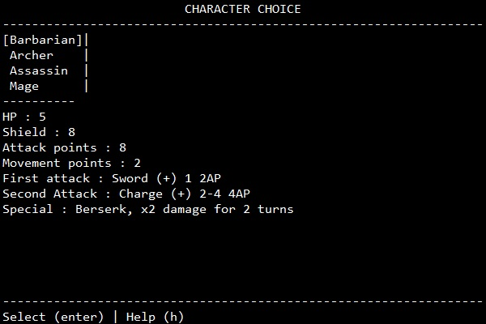
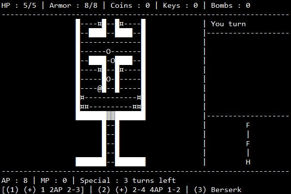

# Python-Dungeon-Quest-Roguelike

This is a retro console style roguelike. Battles are turn-based.
## Features
- Item rooms
- Shops
- Devildeal rooms
- Secret rooms
- 3 bosses
- 11 items
- 4 playable characters
## Installation
1. Download the repository by clicking on `Code > Download ZIP`
2. Extract the ZIP file
3. Run `main.pyw`
## Requirements
- Python 3.7
- Python `tkinter` library
- Python `random` library
- Python `time` library
## Game Captures

